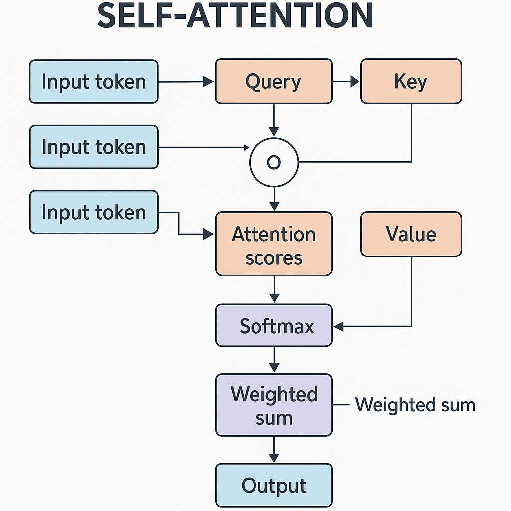
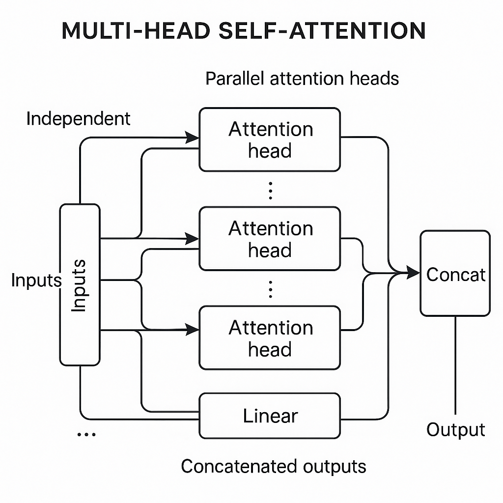

# Demystifying Self-Attention in Transformer Architecture

## Introduction to Transformer Architecture and Role of Self-Attention

The transformer architecture revolutionized sequence modeling by replacing recurrent and convolutional approaches with a purely attention-based mechanism. Unlike RNNs and CNNs, which process input sequentially or via fixed-size receptive fields, transformers handle sequence data through parallelizable operations, significantly improving training efficiency and enabling modeling of long-range dependencies more effectively.

A standard transformer consists of two primary components: the encoder and the decoder. Both are composed of stacked layers that include multi-head attention blocks and feed-forward neural networks. The encoder processes the input sequence and generates contextualized representations, while the decoder generates output tokens autoregressively, attending to both previous outputs and encoder states. Central to this architecture is the multi-head attention mechanism, which exploits multiple attention functions simultaneously to capture diverse features across the sequence.

At the heart of these attention mechanisms lies self-attention, which allows each element in the input sequence to attend to every other element within the same sequence. This differs from traditional attention mechanisms that typically attend over external context or prior states. By attending internally, self-attention builds rich contextual embeddings that represent the relationships between all token positions, regardless of their distance.

Self-attention offers several key advantages. It naturally captures long-range dependencies without the vanishing gradient issues inherent in RNNs. Because each token’s representation is derived in parallel, transformers scale efficiently to longer sequences and larger datasets. Additionally, this parallelism facilitates hardware acceleration and optimization during training, further boosting performance.

In summary, self-attention is the core enabler of the transformer’s capabilities, allowing flexible, scalable, and context-aware sequence representation that outperforms traditional sequential models on a variety of tasks. Understanding this mechanism is essential for developers building or debugging transformer-based models.


*High-level overview of the Transformer architecture highlighting self-attention in encoder and decoder.*

## Mechanics of the Self-Attention Mechanism

At the core of a transformer layer lies the self-attention mechanism, which enables the model to dynamically relate different positions in the input sequence. Understanding its computation is essential for effective model design and debugging.

### Query, Key, and Value Vectors

Given an input sequence represented as a matrix \( X \in \mathbb{R}^{n \times d} \) (where \(n\) is the sequence length and \(d\) the embedding dimension), self-attention begins by projecting \(X\) into three distinct spaces: queries \(Q\), keys \(K\), and values \(V\). Each is obtained through learned linear transformations:

\[
Q = X W^Q, \quad K = X W^K, \quad V = X W^V
\]

where \( W^Q, W^K, W^V \in \mathbb{R}^{d \times d_k} \) are learned projection matrices, and \( d_k \) is the dimension of queries and keys (typically \( d_k \leq d \)).

This design allows the model to represent each input token with three customized embeddings tailored for attention scoring and value aggregation.

### Computing Attention Scores via Scaled Dot-Product

Next, the attention scores between each query and all keys are computed using the dot product:

\[
\text{scores} = Q K^\top
\]

To ensure the dot products do not grow too large in magnitude (which could cause vanishing gradients through softmax), the scores are scaled by the square root of the key dimension:

\[
\text{scaled scores} = \frac{Q K^\top}{\sqrt{d_k}}
\]

This scaling stabilizes gradients during training, especially when \( d_k \) is large.

### Softmax Normalization to Obtain Attention Weights

The scaled scores are then passed through a softmax operation along the keys dimension, producing normalized attention weights:

\[
\alpha_{ij} = \frac{\exp\left(\frac{q_i \cdot k_j}{\sqrt{d_k}}\right)}{\sum_{j=1}^n \exp\left(\frac{q_i \cdot k_j}{\sqrt{d_k}}\right)}
\]

Here, each \( \alpha_{ij} \) indicates how much token \(i\) attends to token \(j\). This normalization ensures all weights for a given query sum to 1, forming a proper probability distribution.

### Computing the Output as Weighted Sum of Values

Finally, the output representation for each token is calculated as the weighted sum of the value vectors:

\[
\text{output}_i = \sum_{j=1}^n \alpha_{ij} v_j
\]

This step integrates relevant contextual information from the entire sequence, modulated by learned attention weights.

### Summary and Minimal Pseudocode Example

```python
import numpy as np

def self_attention(X, WQ, WK, WV):
    # X: (n, d), input embeddings
    # WQ, WK, WV: (d, dk), projection matrices

    Q = X @ WQ              # (n, dk)
    K = X @ WK              # (n, dk)
    V = X @ WV              # (n, dv), often dv == dk

    scores = Q @ K.T        # (n, n)
    scaled_scores = scores / np.sqrt(K.shape[1])  # scale by sqrt(dk)

    weights = np.exp(scaled_scores)
    weights /= weights.sum(axis=1, keepdims=True)  # softmax normalization

    output = weights @ V    # (n, dv) weighted sum of values
    return output
```

### Edge Cases and Debugging Tips

- **Dimension Mismatch:** Ensure all projection matrices have compatible dimensions. Mismatched shapes during matrix multiplication lead to runtime errors.
- **Zero or Inf Values in Scores:** Extremely large/small values before softmax can cause numerical instability. Check inputs and consider adding small epsilon if needed.
- **Unequal Projection Dimensions:** While \( d_k = d_v \) is common, differing sizes can be used; ensure subsequent layers handle output dimension accordingly.

Understanding these computations and their implementation nuances equips developers to optimize transformer-based architectures and troubleshoot attention-related issues effectively.

## Multi-Head Self-Attention and Its Advantages

Multi-head self-attention is a core innovation in transformer architectures where several independent self-attention mechanisms operate in parallel. Rather than computing a single attention distribution over the input tokens, the model splits its representation space into multiple "heads," each performing its own self-attention calculation. This design allows the model to capture a variety of contextual relationships simultaneously.

Each attention head learns to focus on different aspects or relationships within the input sequence. For example, one head might attend to syntactic dependencies, while another focuses on semantic roles or long-range dependencies. This diversity in focus enables the model to extract richer and more nuanced information from the same input data, improving the overall contextual representation.

After each head computes its respective attention output, the results are concatenated into a single combined tensor. This concatenated tensor is then linearly transformed through a learned weight matrix to integrate the multi-head outputs into a cohesive form suitable for subsequent layers. This step ensures that the distinct perspectives captured by each head contribute meaningfully to the overall representation.

The primary advantage of multi-head attention is a richer, more expressive feature space. By capturing multiple types of relationships in parallel, the model gains flexibility and robustness, which often translates into better performance on complex tasks like machine translation or language understanding. The multiple heads diversify the attention patterns, helping the model generalize beyond what a single-head attention layer can achieve.

However, this increase in representational power comes with a computational cost. Running multiple self-attention heads in parallel requires more matrix operations and memory, which can impact training and inference efficiency. Developers should be mindful of this trade-off and balance the number of heads with their available resources and latency requirements, especially in production environments.

In summary, multi-head self-attention enhances transformer architectures by learning multiple complementary relationships in the input, yielding richer representations at the cost of additional computation. Understanding this mechanism helps developers design more effective architectures and optimize performance.


*Detailed flow of the self-attention mechanism including query, key, value projections, scaled dot-product attention, softmax normalization, and output computation.*

## Implementation Considerations and Efficiency Optimization

When implementing self-attention in transformers, managing tensor shapes and computational resources efficiently is crucial for optimal performance. Typically, input tensors for batch computations follow the shape `(batch_size, sequence_length, embedding_dim)`. Queries (Q), keys (K), and values (V) are derived from this input by applying linear projections, each maintaining the batch and sequence dimensions but often mapping to a fixed `head_dim` size for multi-head attention. To enable parallelism, these tensors are reshaped to `(batch_size, num_heads, sequence_length, head_dim)`, allowing simultaneous computation of attention across heads.

A central challenge is the quadratic memory and compute complexity of self-attention, O(n²) with respect to the input sequence length `n`. As the sequence grows, the attention score matrix, sized `(sequence_length, sequence_length)`, becomes a significant bottleneck. This can lead to large memory consumption and longer computation times, impacting scalability especially in long-context applications like document-level understanding or speech.

To mitigate these issues, common optimizations include:

- **Attention Masking:** Used to prevent attention to padding tokens or future tokens in autoregressive models, saving unnecessary computation and maintaining causal structure.
- **Sparse Attention Variants:** These approximate full attention by restricting the connectivity pattern, for example using local windows or strided patterns. Sparse attention reduces complexity, making it feasible to handle longer sequences at a fraction of the resource cost.

Debugging self-attention requires careful inspection of intermediate tensors:

- Verify that query, key, and value projections have the correct dimensions and expected initialization.
- Confirm that attention weight matrices are computed correctly as dot products of Q and K, scaled by 2head_dim2.
- Check that softmax outputs are normalized properly  sums should be close to one across the attention dimension.
- Use small, controlled inputs and print intermediate results when possible to isolate errors.

Popular frameworks such as PyTorch and TensorFlow provide highly optimized attention modules in their respective libraries (`torch.nn.MultiheadAttention` and `tf.keras.layers.MultiHeadAttention`). These implementations often include fused kernels and efficient memory layouts that handle many of the above considerations internally, offering a balance between performance and ease of use. For custom modifications or research purposes, these can serve as valuable starting points or benchmarks for correctness and speed.

By understanding these practical aspects and leveraging the available tools, developers can build efficient, scalable self-attention mechanisms tailored to their specific application constraints.

## Edge Cases and Failure Modes in Self-Attention

When implementing self-attention mechanisms in transformer architectures, developers must be aware of several edge cases and failure modes that can impact both performance and model reliability.

**1. Extremely Long Sequences**  
Handling very long input sequences can significantly strain memory resources due to the quadratic complexity of self-attention (O(n) with respect to sequence length *n*). This bottleneck can lead to out-of-memory errors or force reductions in batch size, negatively affecting training stability. Moreover, the quality of attention may degrade as the model struggles to maintain meaningful interactions over distant tokens, leading to diluted focus and ineffective context capture.

**2. Numerical Instability in Softmax**  
The softmax operation used to compute attention weights is susceptible to numerical instability. Large or small floating-point values in the attention logits can cause overflow or underflow, resulting in NaNs or vanishing gradients during backpropagation. Such instability can halt training or degrade convergence rates. Scaling techniques, such as subtracting the maximum logit before softmax or using log-sum-exp tricks, are critical to maintaining numerical robustness.

**3. Attention Collapse**  
A common failure mode is the collapse of attention weights onto a very limited subset of tokens, sometimes concentrating on a single token repeatedly across different input positions. This phenomenon limits the model's expressivity and ability to generalize because it effectively ignores other relevant context, reducing the richness of learned dependencies. Monitoring attention distributions during training can help catch this early.

**4. Challenges in Interpretability**  
Diffuse or nearly uniform attention weights complicate interpretation, making it hard to attribute model decisions to specific input tokens. This lack of clarity can hinder debugging and trust in model outputs. Furthermore, even when attention appears focused, causal relationships may not straightforwardly map from attention scores, requiring caution in analysis.

**5. Detection and Mitigation Strategies**  
- **Monitoring**: Track attention weight distributions and look for patterns such as extreme sparsity or diffusion. Visual tools like attention heatmaps are valuable.  
- **Gradient Checks**: Monitor for NaNs or exploding/vanishing gradients, especially after softmax, employing techniques like gradient clipping where necessary.  
- **Regularization**: Incorporate dropout on attention weights or entropy penalties to encourage diverse attention.  
- **Sequence Length Handling**: Adopt techniques like sparse attention, windowed attention, or local/global hybrid models to manage very long inputs efficiently.  
- **Debugging**: Use synthetic inputs to isolate failure conditions and validate that attention behaves as expected.

By proactively addressing these edge cases, developers can build more robust, interpretable self-attention models suited for complex tasks.

## Summary and Best Practices for Leveraging Self-Attention

Self-attention is a fundamental mechanism enabling transformers to capture dependencies across entire input sequences efficiently. Unlike traditional recurrent models, it computes context-aware representations by relating each token directly to every other token, making it especially powerful for handling long-range dependencies and parallel processing in sequence modeling.

When implementing self-attention, verify that all projection dimensions align correctlyquery, key, and value vectors should consistently match the models hidden size and the chosen number of attention heads. Ensuring your batch processing logic accommodates variable sequence lengths (e.g., through padding and masking) is crucial to maintain computational efficiency and avoid corrupting attention scores.

Monitoring attention weight distributions is a practical debugging step. Uniformly low or excessively peaked attention weights may indicate learning issues or bugs in masking. Visualizing these distributions can provide insights into whether the model is attending to relevant tokens and help detect anomalies early.

Balancing model expressiveness and computational load hinges primarily on two factors: the number of attention heads and the maximum sequence length. Increasing heads often improves model capacity but linearly adds to memory and compute requirements due to multiple projections. Similarly, longer sequences amplify quadratic complexity in attention computation. Choose these hyperparameters mindfully to suit available hardware and latency constraints.

For a deeper understanding, exploring foundational papers like "Attention Is All You Need," studying efficient transformer variants (e.g., Linformer, Performer), and leveraging tutorials with hands-on self-attention implementations will enhance your mastery and practical skills.


*Visualization of multi-head self-attention showing multiple attention heads, their parallel computations, concatenation, and final linear projection.*